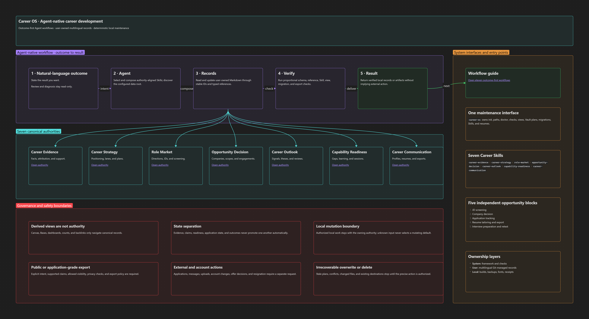
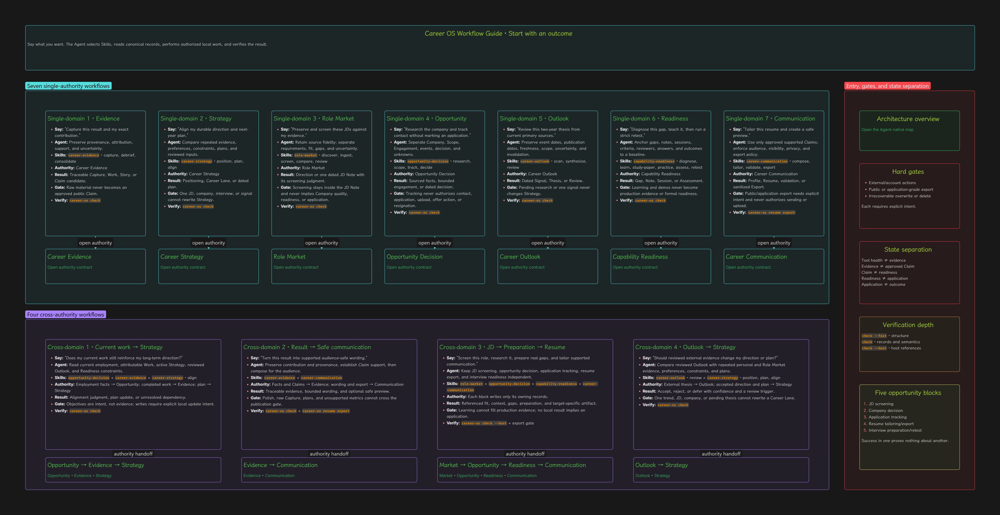

# Career OS

> An Agent-native, local-first, and embeddable career development operating system for Obsidian.

Career OS keeps career evidence, strategy, market sensing, opportunity decisions, capability readiness, and career communication in one locally owned system. Agents operate the workflows, Obsidian renders the knowledge, and a deterministic CLI validates and maintains the system.

## Start here

- **Work with your career data:** open the root
  [Career Home](Home.md) in Obsidian, choose the language at the top, describe the outcome to an Agent, and use
  the five live Workbenches. The configured data-root `README.md`,
  [dashboard](system/obsidian/dashboard.md), and
  [all-records Base](system/obsidian/records.base) remain lightweight text and
  inventory fallbacks.
- **Install or maintain Career OS:** start from the
  [framework documentation map](docs/README.md), then follow the installation
  or contributor guidance for the task at hand.

## Design

- **Agent-native:** describe the outcome; the Agent selects and composes Skills.
- **Local-first:** canonical data is Markdown and open files under a user-owned data root.
- **Embeddable:** use Career OS as its own Vault or nest it inside an existing Vault.
- **System/data separation:** versioned implementation lives in `system/`; user data lives in `career/` or another configured data root.
- **Multilingual data:** framework text is English while user content supports Unicode and BCP 47 language tags.
- **Bilingual Workbenches:** the five operational Bases ship as system-owned English and Chinese presentation pairs over identical record queries.
- **Evidence-led:** mechanism health, evidence maturity, readiness, applications, and outcomes remain separate states.

## Visual overview

### Agent-native architecture

[](system/obsidian/career-map.canvas)

[Open the full-size PNG](docs/assets/career-map.png) · [Open the source Canvas](system/obsidian/career-map.canvas)

### Outcome-first workflow guide

[](system/obsidian/career-guide.canvas)

[Open the full-size PNG](docs/assets/career-guide.png) · [Open the source Canvas](system/obsidian/career-guide.canvas)

These reviewed PNGs are native Obsidian Full canvas exports of the tracked
Canvas sources. The Canvas files remain canonical; see
[`docs/assets/README.md`](docs/assets/README.md) for the export contract.

## Recommended installation

### Repository relationship

This public checkout declares
`development_topology = "standalone-framework"` and contains framework assets,
synthetic fixtures, and deterministic validation only. Keep real career
records, identity, attachments, font binaries, active Obsidian state, and
generated outputs in an initialized private Career Home, never in a public
GitHub fork.

`v0.1.0` supports clean installations only. It does not define an in-place
upgrade path from any `v0.1.0-rc.*` checkout.

For an embedded installation, keep the private Career Home beside the existing
Obsidian Vault and mount it through a host-tracked relative directory symlink.
`upstream` is the conventional optional remote name for the canonical public
framework repository,
[`sean2077/career-os`](https://github.com/sean2077/career-os). When retained in
the private downstream it must be fetch-only with
`remote.upstream.pushurl=DISABLED`. A personal `origin` is appropriate only
after its owner has confirmed the hosted repository is private.

Install the core prerequisites described in the
[installation requirements](docs/installation.md) before starting. Obsidian and
the XeLaTeX resume stack have separate readiness gates.

Clone the public framework:

```text
git clone https://github.com/sean2077/career-os.git career-home
cd career-home
```

Cloning initially creates a pushable public `origin`. Before adding personal
data, choose one of these local remote policies:

```text
# Keep the optional public update remote:
git remote rename origin upstream
git remote set-url --push upstream DISABLED

# Or keep no public remote:
git remote remove origin
```

Then initialize the private Career Home:

```text
uv sync --locked
# Create and stage the relative Vault symlink described in the guide first.
uv run career-os init --mode embedded --root . --vault-root ../obsidian-vault --vault-mount Career/career-home --languages en
uv run career-os doctor --json
uv run career-os check
uv run career-os views build
```

Read the [private downstream guide](docs/private-downstream.md) when operating
in split-downstream mode. It defines the cross-platform symlink, remote-safety
guard, and exact-tag update workflow.

## Quick start

```powershell
uv sync --locked
uv run career-os init --mode standalone --root . --languages en
uv run career-os doctor --json
uv run career-os check
```

Resume support is optional and requires the XeLaTeX dependencies documented in
the [installation requirements](docs/installation.md):

```powershell
uv run career-os resume fonts fetch
uv run career-os resume doctor --json
```

For installation inside another Obsidian Vault:

```powershell
uv run career-os init --mode embedded --root . --vault-root C:\path\to\vault --vault-mount Career/career-home --languages en,zh-CN
uv run career-os vault plan --action attach --vault-root C:\path\to\vault
# Review the emitted plan, then:
uv run career-os vault apply --plan .career-os\plans\vault-attach-<id>.json
```

Review [the documentation map](docs/README.md) before applying a generated plan.
The root [English Career Home](Home.md) and [中文职业主页](主页.md), plus the
generic public Base, architecture Canvas, workflow-guide Canvas, dashboard, and ten paired English/Chinese
Workbench Bases under `system/obsidian/`, are Git-tracked framework assets. The
English homepage embeds the five English Bases; the Chinese homepage embeds the
five Chinese counterparts. `career-os init` never creates or overwrites either
homepage or any Base. `uv run career-os views build` validates and lists all
sixteen framework assets without
creating data-root or `runtime/` copies.

Create a user-owned direct XeLaTeX resume with
`uv run career-os resume new my-resume`. Internal builds remain under `build/`;
only `resume export` writes a shareable PDF. Personal roots remain handwritten
TeX, are discovered recursively by name, and use the one system-owned,
legacy-calibrated class plus adjacent `identity.tex`. Preview and application
are fixed output profiles; Git owns source versions and export receipts compute
hashes automatically. Personal font filenames may be set before the class in
TeX, while binaries remain in ignored `.career-os/fonts/` state. See
[the resume guide](docs/resume.md).

## Agent Skills

Career OS ships seven project-owned career workflow Skills, plus locked snapshots of selected Skills from [sean2077/skills](https://github.com/sean2077/skills) and [kepano/obsidian-skills](https://github.com/kepano/obsidian-skills). See [the Skill catalog](docs/skills.md) for ownership and attribution.

## Status

The current stable line is `v0.1.0`; see its
[verification evidence](docs/releases/v0.1.0.md). Before `v1.0`, only the
interfaces explicitly documented by a release are supported.

## License

Project-owned work is licensed under the [MIT License](LICENSE). Bundled
dependencies retain their original licenses and attribution; see [NOTICE](NOTICE),
`skills-lock.json`, and the deterministic [CycloneDX SBOM](system/sbom.cdx.json).
