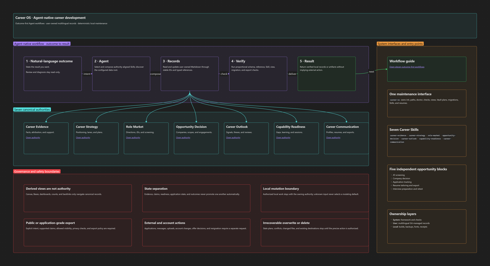
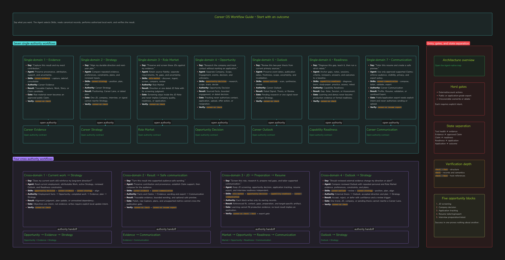

# Career OS

> An Agent-native, local-first, and embeddable career development operating system for Obsidian.

Career OS keeps career evidence, strategy, market sensing, opportunity choices, capability readiness, and career communication in one locally owned system. Agents orchestrate the work, Obsidian presents user-owned Markdown, and the `career-os` CLI supplies deterministic setup, maintenance, and safety checks.

## Choose a path

| Goal | Start here |
| --- | --- |
| Use an initialized Career Home | Open [`Career Home.md`](<Career Home.md>) or [`职业主页.md`](职业主页.md), then describe the outcome to an Agent. |
| Find the smallest workflow | Use the [outcome-first workflow guide](docs/workflows.md). |
| Evaluate the public, data-free framework | Follow the [core-only evaluation](docs/installation.md#evaluate-the-public-framework). |
| Create a real personal installation | Follow the [private downstream guide](docs/private-downstream.md) before adding personal data. |
| Attach Career OS to an existing Vault | Complete the private-repository boundary, then follow [Embedded Vaults](docs/embedded-vault.md). |
| Maintain or contribute to the framework | Read [CONTRIBUTING.md](CONTRIBUTING.md) and the [documentation map](docs/README.md). |

## Why Career OS

- **Agent-native:** ask for an outcome; the Agent selects one primary authority and composes only the additional authorities that can change the result.
- **Local-first:** canonical career data is Markdown and open files under the user-owned `career/` root.
- **Embeddable:** use Career OS as the Vault root or mount a private Career Home inside another Obsidian Vault.
- **Separated ownership:** versioned framework behavior lives under `system/`; local state and generated output never become career facts.
- **Evidence-led:** mechanism health, evidence maturity, readiness, application state, and external outcomes remain separate claims.
- **Multilingual:** framework documentation is English; user content supports Unicode and BCP 47 language tags, with English and Chinese Workbench views.

## Visual overview

### Agent-native architecture

[Open the full-size PNG](docs/assets/career-map.png) · [Open the source Canvas](system/obsidian/career-map.canvas)

### Outcome-first workflow guide

[Open the full-size PNG](docs/assets/career-guide.png) · [Open the source Canvas](system/obsidian/career-guide.canvas)

The Canvas files are canonical. The reviewed PNG exports follow the [visual-asset contract](docs/assets/README.md).

## Evaluate or install

The public repository contains framework assets, synthetic fixtures, and release evidence only. [Install and Verify Career OS](docs/installation.md) owns the current requirements, public-framework smoke sequence, initialization commands, and capability-specific readiness recipes.

Do not add real career records, identity, attachments, fonts, active Obsidian state, or generated exports to a public fork. Establish the private topology and guarded remote policy in [Private Downstream Installation](docs/private-downstream.md) before initializing a real Career Home. For an existing Obsidian Vault, continue with the reviewed plan/apply flow in [Embedded Vaults](docs/embedded-vault.md).

## Ownership at a glance

| Path | Owner | Purpose |
| --- | --- | --- |
| `career/` | User | Canonical multilingual records and handwritten resume sources |
| `system/` | Framework | CLI implementation, schemas, seeds, views, resume assets, migrations, and tests |
| `.agents/` | Framework | Project-owned Skills, reviewers, and dual-host Agent harness source |
| `.career-os/` | Local machine | Ignored install state, plans, receipts, downloaded fonts, and runtime scratch |
| `build/` | Local machine | Ignored previews, exports, and other generated output |
| Root homepages and Bases | Framework | Obsidian projections over canonical records; never the record authority |

## Capability guides

- [Outcome-first workflows](docs/workflows.md): minimum-context routing, persistence decisions, cross-authority handoffs, and stopping rules.
- [Career Skills](docs/skills.md): authority ownership, optional auxiliary Skill onboarding, and read-only reviewer boundaries.
- [Data model](docs/data-model.md): record envelope, lifecycle, references, visibility, and multilingual content.
- [Resume system](docs/resume.md): handwritten XeLaTeX sources, identity policy, privacy gates, and exports.
- [Embedded Vaults](docs/embedded-vault.md): supported layouts, attach/detach, host-owned mounts, shared views, and QuickAdd.
- [Legacy imports](docs/importing.md): reviewed, hash-bound copy and transform plans with rollback.

## Documentation, releases, and security

The [documentation map](docs/README.md) routes installation, operation, architecture, maintenance, and release tasks to one authoritative page. Historical changes and verification evidence live in the [release index](docs/releases/README.md) and [CHANGELOG.md](CHANGELOG.md); current how-to pages describe current behavior rather than repeating release history. Before `v1.0`, only interfaces explicitly documented by a release are supported.

For privacy and vulnerability reporting, read [SECURITY.md](SECURITY.md).

## License

Project-owned work is licensed under the [MIT License](LICENSE). External components retain their own licenses and attribution; see [NOTICE](NOTICE), the [supply-chain guide](docs/supply-chain.md), and the deterministic [CycloneDX SBOM](system/sbom.cdx.json).
